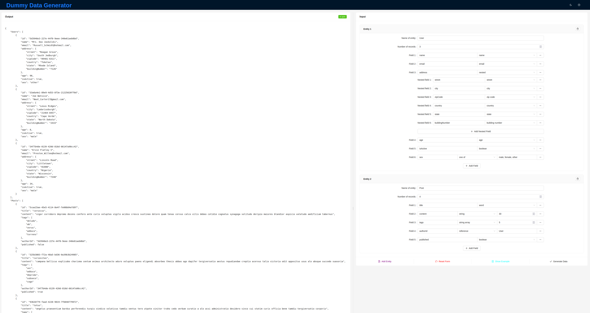
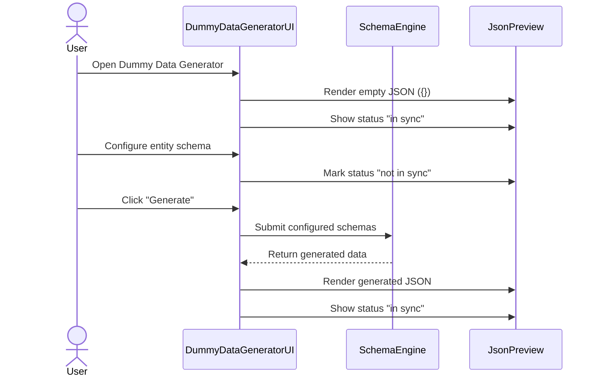

# Dummy Data Generator

  

A tool to generate json dummy data with linked entities and nested objects.

The tool makes use of [faker.js](https://fakerjs.dev/guide/).

## Flow

This diagram summarizes the high-level behavior of the flow using this tool. It focuses on the main actors and steps, not on specific field definitions or data values.

